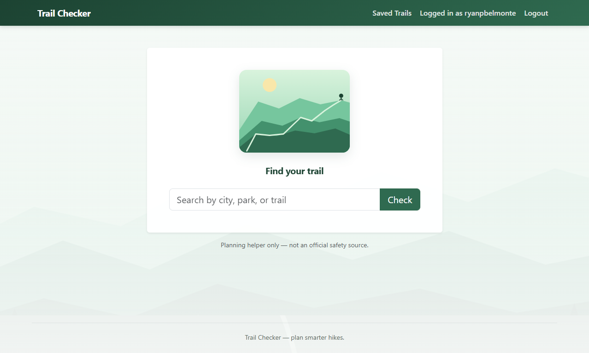
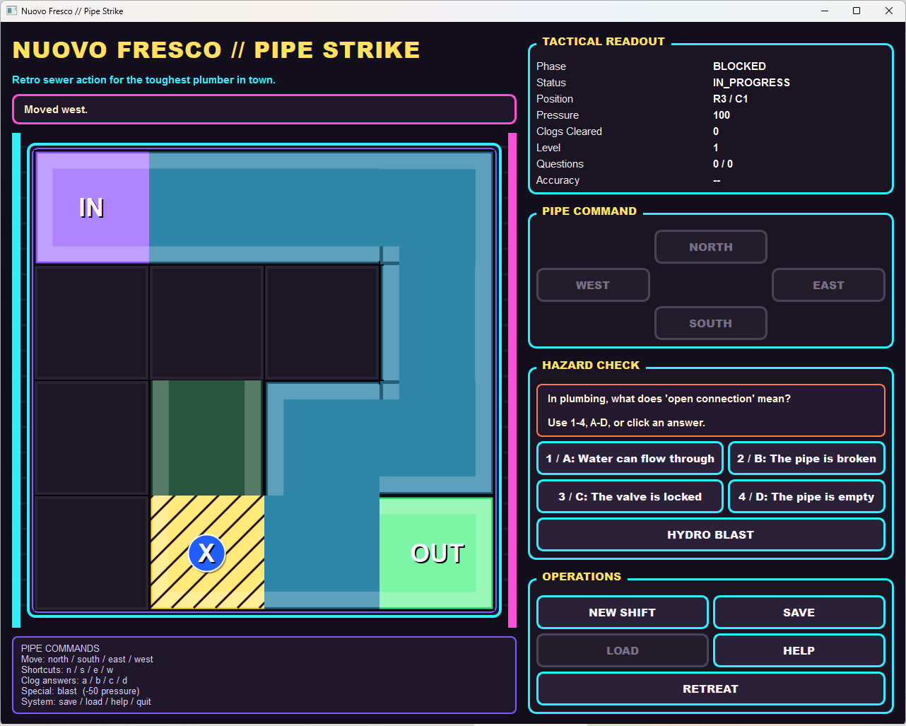

# Hi, I'm Ryan Belmonte

Software engineer with a Graduate Certificate in Software Development Engineering (UW Tacoma, 2026).
I build backend and full-stack applications in **Python, Flask, PostgreSQL, Docker, and AWS**,
with automated testing and CI. Previously 15+ years delivering production systems in healthcare
(Epic, FHIR, OAuth integrations, regulated go-lives).

## Featured projects

### Trail Conditions Checker (Web app)

3-person team capstone — **server-side/API owner**  
Flask · PostgreSQL · OpenWeather REST APIs · GitHub OAuth · Docker Compose · nginx/gunicorn on AWS EC2 · pytest + Playwright CI (52 tests)

[Repo](https://github.com/ryanpbelmonte/trail-conditions-checker-capstone)

*Live demo available on request* — see screenshot below.

### Nuovo Fresco Pipe Network (Trivia Maze)

3-person team project — **persistence/architecture owner**  
Python · SQLModel/SQLite · pytest (116 tests) · PyQt6 GUI · contract-driven module boundaries

[Repo](https://github.com/nstjern-uw/TCSS504_TriviaMaze_CacheKings)

*Live demo available on request* — see screenshot below.

## Connect

- [LinkedIn](https://www.linkedin.com/in/ryan-belmonte/)
- [Portfolio](https://ryan.belmonte.us.com/)
- Open to: Software Engineer · Backend · Full Stack · Integration/Platform roles
